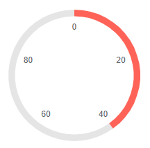
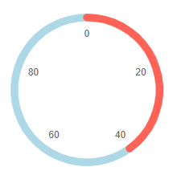
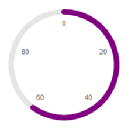
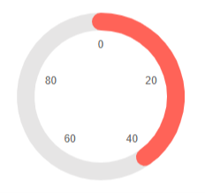

# Circular Gauge Pointers

The pointers are the values that will be marked on the scale. You can customize them through the parameters they expose:

* [LineCap](#linecap)

* [PlaceholderColor](#placeholdercolor)

* [Color](#color)

* [Size](#size)

## LineCap

The `LineCap` parameter controls the shape of the scale ending and takes a member of the `CircularGaugePointerLineCap` enum:

* `Round` - by default the shape of the scale ending would be round

* `Butt` - flat scale ending shape

>caption Change the shape of the scale. The result from the code snippet below.



````RAZOR
@* Use a flat shape for the end of the scale *@

<MariloCircularGauge>
    <CircularGaugePointers>

        <CircularGaugePointer LineCap="@CircularGaugePointerLineCap.Butt" Value="40">
        </CircularGaugePointer>

    </CircularGaugePointers>

    <CircularGaugeScales>

        <CircularGaugeScale>
            <CircularGaugeScaleLabels Visible="true" />
        </CircularGaugeScale>

    </CircularGaugeScales>
</MariloCircularGauge>
````

## PlaceholderColor

The `PlaceholderColor` (`string`) parameter controls the background color of the pointer. It accepts **CSS**, **HEX** and **RGB** colors.

>caption Change the background color of the pointer. The result from the code snippet below:



````RAZOR
@* Set the PlaceholderColor to light blue *@

<MariloCircularGauge>
    <CircularGaugePointers>

        <CircularGaugePointer PlaceholderColor="lightblue" Value="40">
        </CircularGaugePointer>

    </CircularGaugePointers>

    <CircularGaugeScales>

        <CircularGaugeScale>
            <CircularGaugeScaleLabels Visible="true" />
        </CircularGaugeScale>

    </CircularGaugeScales>
</MariloCircularGauge>
````

## Color

The `Color` (`string`) parameter controls the color of the pointer. It accepts **CSS**, **HEX** and **RGB** colors.

>caption Change the color of the pointer. The result from the code snippet below



````RAZOR
@* Change the color of the pointer to purple *@

<MariloCircularGauge>
    <CircularGaugePointers>

        <CircularGaugePointer Color="purple" Value="60">
        </CircularGaugePointer>

    </CircularGaugePointers>

    <CircularGaugeScales>

        <CircularGaugeScale>
            <CircularGaugeScaleLabels Visible="true" />
        </CircularGaugeScale>

    </CircularGaugeScales>
</MariloCircularGauge>
````

## Size

The `Size` (`double`) parameter controls the size of the pointer.



````RAZOR
@* Change the size of the pointer *@

<MariloCircularGauge>
    <CircularGaugePointers>

        <CircularGaugePointer Size="20" Value="40">
        </CircularGaugePointer>

    </CircularGaugePointers>

    <CircularGaugeScales>

        <CircularGaugeScale>
            <CircularGaugeScaleLabels Visible="true" />
        </CircularGaugeScale>

    </CircularGaugeScales>
</MariloCircularGauge>
````

## See Also

* [Live Demo: Circular Gauge](https://demos.marilo.com/blazor-ui/circulargauge/overview)
* [Circular Gauge: Overview](slug:circular-gauge-overview)
* [Circular Gauge: Scale](slug:circular-gauge-scale)
* [Circular Gauge: Labels](slug:circular-gauge-labels)
