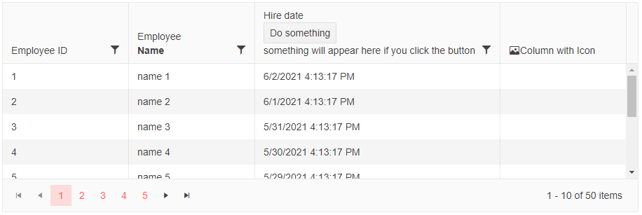

# Column Header Template

Bound columns render the name of the field or their `Title` in their header. Through the `HeaderTemplate`, you can define custom content there instead of the title text.

>tip If you only want to center or wrap the column header text, you can achieve that with some custom CSS. You can try one of the following approaches depending on the desired result - [Center Grid Column Header content](slug:grid-kb-center-column-header-content) or [Wrap and center the Grid column header text](slug:grid-kb-wrap-and-center-column-header-text).

>caption Sample Header Template

````RAZOR
@* Header templates override the built-in title but leave sorting indicators and filter menu icons *@

<MariloDataGrid Data="@MyData" Height="300px" Pageable="true" Sortable="true" FilterMode="@GridFilterMode.FilterMenu">
        <MariloGridColumn Field="@(nameof(SampleData.Id))" Title="This title will not be rendered">
            <HeaderTemplate>
                <span>Employee ID</span>
            </HeaderTemplate>
        </MariloGridColumn>
        <MariloGridColumn Field="@(nameof(SampleData.Name))">
            <HeaderTemplate>
                Employee<br /><strong>Name</strong>
            </HeaderTemplate>
        </MariloGridColumn>
        <MariloGridColumn Field="HireDate" Width="350px">
            <HeaderTemplate>
                <span @onclick:stopPropagation>
                    Hire date<br />
                    <MariloButton OnClick="@DoSomething">Do something</MariloButton>
                </span>
                <br />
                @{
                    if (!string.IsNullOrEmpty(result))
                    {
                        <span style="color:red;">@result</span>
                    }
                    else
                    {
                        <div>something will appear here if you click the button</div>
                    }
                }
            </HeaderTemplate>
        </MariloGridColumn>
        <MariloGridColumn>
            <HeaderTemplate>
                <span>
                    <MariloSvgIcon Icon="@SvgIcon.Image" />
                    Column with Icon
                </span>
            </HeaderTemplate>
        </MariloGridColumn>
</MariloDataGrid>

@code {
    string result { get; set; }
    void DoSomething()
    {
        result = $"button in header template clicked on {DateTime.Now}, something happened";
    }

    public class SampleData
    {
        public int Id { get; set; }
        public string Name { get; set; }
        public DateTime HireDate { get; set; }
    }

    public IEnumerable<SampleData> MyData = Enumerable.Range(1, 50).Select(x => new SampleData
    {
        Id = x,
        Name = "name " + x,
        HireDate = DateTime.Now.AddDays(-x)
    });
}
````

>caption The result from the code snippet above



## See Also

 * [Live Demo: Grid Templates](https://demos.marilo.com/blazor-ui/grid/templates)
 * [Live Demo: Grid Custom Editor Template](https://demos.marilo.com/blazor-ui/grid/custom-editor)
 * [Blazor Grid](slug:grid-overview)
