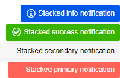

# Stacked Notifications

When you invoke multiple notifications from the same component reference they will be stacked on the screen. Notifications which derive from different references will be rendered on top of one another.

>caption Stacked Notifications in Marilo UI for Blazor



````RAZOR
@* Calling Show() before the previous notifications hide will stack the new messages above the old ones *@

<MariloButton OnClick="@AddStackedNotifications">Add stacked notifications</MariloButton>

<MariloNotification @ref="@NotificationReference" />

@code {
    public MariloNotification NotificationReference { get; set; }
    public string[] ColorOptions = new string[4] { "primary", "secondary", "success", "info" };

    public void AddStackedNotifications()
    {
        foreach (var color in ColorOptions)
        {
            NotificationReference.Show(new NotificationModel()
            {
                Text = $"Stacked {color} notification",
                ThemeColor = $"{color}"
            });
        }
    }
}
````


## See Also

  * [Live Demo: Notification Overview](https://demos.marilo.com/blazor-ui/notification/overview)
  * [Notification Overview](slug:notification-overview)
  * [One Notification Instance for All Components Sample Project](https://github.com/marilo/blazor-ui/tree/master/notification/single-instance-per-app)
